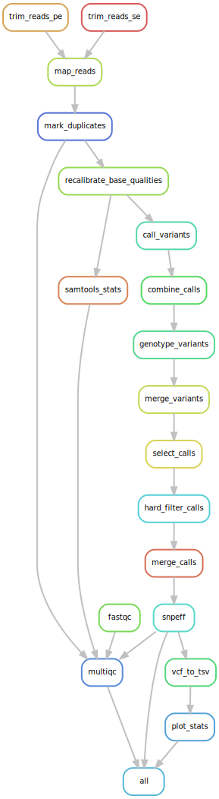
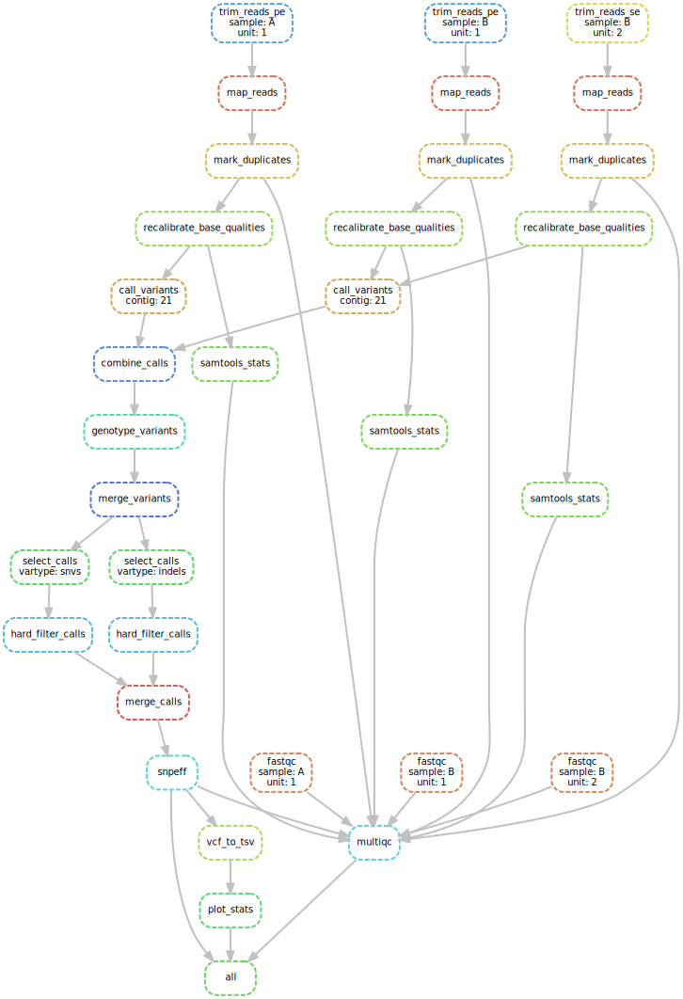

[](http://beta.mybinder.org/v2/gh/alperyilmaz/conda-snakemake-gatk/master?urlpath=lab/tree/index.ipynb)

# conda-snakemake-gatk

snakemake pipeline for gatk running on binder

## initialize index and dictionary

If you clone this repo, index and dictionary are already included. If you use different genome or change location of genome please run initialize rule first

```bash
snakemake --use-conda -s rules/initialize.smk 
```

## local use

```bash
snakemake  --use-conda --cores 8
```

after pipeline finishes, you can generate the report with following command

```bash
snakemake --use-conda --report gatk-report.html
```

## cluster instructions

after installing conda in the cluster, edit the `truba.json` file and then please run following commands

```bash
git clone https://github.com/alperyilmaz/conda-snakemake-gatk/

cd conda-snakemake-gatk/

conda install pandas jinja2 networkx pygraphviz

snakemake -j 999 --use-conda --cluster-config truba.json --cluster "sbatch -A {cluster.account} -p {cluster.partition} -n {cluster.n}  -t {cluster.time} --constraint {cluster.constraint} --export=PATH"

snakemake --use-conda --report gatk-report.html
```

please make sure your `.bashrc` file contains the following lines in your TRUBA home directory

```
. "/truba/home/USERNAME/miniconda3/etc/profile.d/conda.sh"
export PATH="/truba/home/USERNAME/miniconda3/bin:$PATH"
```

> you might need to comment out `conda initialize` section in `.bashrc`

The pipeline will run the following rules in order:



Speficic for this test, following DAG will be executed for given samples and units.


